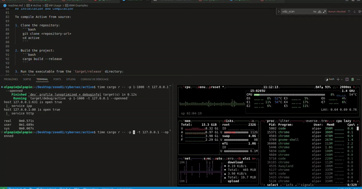

# Port Scan


## Intriduction
port_scan is a simple and efficient port scanner built in Rust. It checks if a specified port (or range of ports) on a target host is open or closed. Additionally, port_scan can display the name of the service associated with each open port.

This project leverages multi-threading to enhance scanning speed, efficiently distributing the scan workload across available CPU cores. This approach significantly reduces the time needed to scan multiple ports.

## Features
- **TCP and UDP Scans**: Choose between TCP or UDP port scans.
- **Range of Ports**: Specify a single port or a range to scan.
- **Multi-threaded Scanning**: Automatically distributes port scanning across multiple threads for faster results.
- **Open Ports Only Option**: Display only the ports that are open using the `--openned` option.
- **Service Name Display**: Optionally displays the name of the service running on open ports.

## Usage
Run `port_scan` with the desired options:

```bash
$ active --help
Usage: active [OPTIONS] [HOST] [PORT]
Options:
  -p               Range of ports to scan
  -u               UDP scan
  -t               TCP scan
  -o, --openned    Show only open ports
  --help           Show this message and exit.
```
### Examples

1. **Single UDP Port Scan**

    ```bash
    $ active -u 20.78.06.364 -p 80
    Port 80 is open
    ```

2. **Single TCP Port Scan**

    ```bash
    $ active -t 127.0.0.1 -p 1604
    Port 1604 is closed
    ```

3. **TCP Range Port Scan**

    ```bash
    $ active -t 10.53.224.5 -p 80-83
    Port 80 is open
    Port 81 is open
    Port 82 is closed
    Port 83 is open
    ```

4. **Open Ports Only**

    Using the `--openned` option will only display ports that are open:

    ```bash
    $ active -t 10.53.224.5 -p 80-83 --openned
    Port 80 is open
    Port 81 is open
    Port 83 is open
    ```
5. **Scan All Ports**

    Using `-p` without a range will scan all ports (1-65535):

    ```bash
    $ active -t 10.53.224.5 -p
    Port 22 is open
    Port 80 is open
    Port 443 is open
    ...
    Port 65535 is closed
    ```

## Multi-threading Implementation

port_scan uses Rust's multi-threading capabilities to divide the range of ports across available CPU cores. This significantly reduces scanning time for larger port ranges. Each thread scans a subset of ports concurrently, making the scan faster and more efficient.

## Installation and Compilation

To compile port_scan from source:

1. Clone the repository:
    ```bash
    git clone https://github.com/alpapie/port_scan.git
    cd port_scan
    ```

2. Build the project:
    ```bash
    cargo build --release
    ```

3. Run the executable from the `target/release` directory:
    ```bash
    ./target/release/port_scan -t 127.0.0.1 -p 22-80
    ```

## Bonus

port_scan can also display the name of the service associated with open ports, providing more insight into the services accessible on the scanned host.
